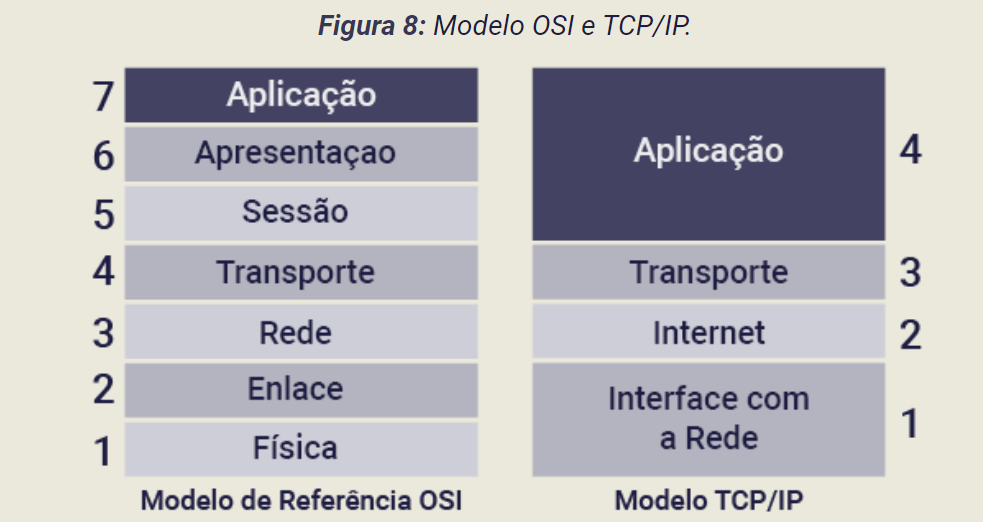
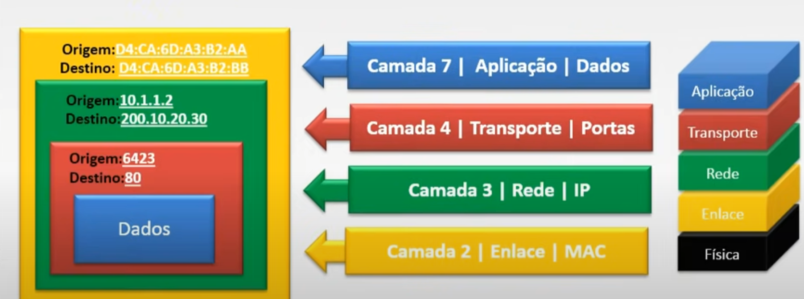

# Redes de Comunicaçao

## Modelos de Comunicaçao

Devido a necessidade de comunicaçao entre dispostivos, como cada empresa tinha seus proprios protocolos, essa comunicaçao nao erra possivel, devido a isso foi criado uma discussao sobre padronizaçao, dessa forma foi criado o modelo OSI como modelo de referencia, e quando ele realmente foi finalizado e ia ser implementado, o modelo TCP/IP ja estava sendo utilizado pela maior parte dos usuarios, entao o modelo OSI acabou ficando como um modelo de estudo e de referencia.

### Processo de Comunicaçao
Cenario: Host 1 Quer se comunicar com Host 2
* Camada de aplicaçao gera dados, esses dados sao enviados para a camada de transporte
* Camada de transporte adiciona um cabeçalho que possui porta(TCP/UDP) de origem e destino, e envia para a camada de internet
* Camada de internet adiciona Ip de Origem e Ip de destino, e envia os dados para a camada Interface 
* Na ultima Camada, adiciona-se o Mac de Origem e Destino, transforma os dados em bits, e atraves de uma conexao, seja eletrica,luminosa,etc, envia-se para o host 2
* O host 2 recebe esses dados em bits, e volta subindo as camadas para ler as informaçoes

* 
### Modelo OSI
* Modelo Teorico
* Desenvolvido Pela ISO
* Descreve como os dados sao transmitidos em uma rede de computadores
* Possue 7 camadas

#### 1 - Camada Fisica
* Camada mais Baixa
* Transmissao dos bits de um computador para outro
* Transmitidos via sinais eletricos por conexoes guiadas ou nao guiadas

#### 2 - Camada Enlace
* Transmissao de quadros (frames)
* Transforma a camada fisica em um link confiavel, garantindo a entrega end-to-end e que a mensagem esteja da mesma forma

##### 3 - Camanda de Rede
* Roteamento dos dados (determina o melhor caminho para a transmissao dos dados)
* Reconhece Origem e Destino e utiliza algoritmos de roteamento para determinar o melhor caminho

#### 4 - Transporte
* Responsavel por percorrer o caminho e determinar como

#### 5 - Sessao
* Estabelecer, Gerenciar e Encerrar Sessoes
* Permite que os aplicativos troquem dados de maneira sincronizada

#### 6 - Apresentaçao
* Lida com as representaçoes dos dados
* Lida com a sintaxe e semantica
* Converte os dados para que sejam entendidos pelo receptor, muitas vezes comprimindo ou criptografando/descriptografando os mesmos

#### 7 - Aplicaçao
* Disponibilizaçao de Serviços

### Modelo TCP/IP

Amplamente usado na internet

#### 1 - Camada Fisica 
- Composta pelos equipamentos de rede e meios de trasminissao/comunicaçao sejam eles guiados ou nao.

#### 2 - Interface de Rede 
- Transmissao dos bits de um computador para o outro

#### 3 - Rede
- Roteamento dos dados e endereçamento logico dos equipamentos

#### 4 - Transporte
- Define os dados em formatos de segmentos e utiliza TCP/UDP para fazer o transporte

#### 5 - Aplicaçao
- Combinada das camadas de aplicaçao, apresentaçao e sessao do modelo osi
- Aplicaçoes como: transferencias de arquivo, email, navegaçao web, etc
- Camadas que lidam com a transmissao dos dados, com uma tarefa especifica e uma comunicaçao entre as mesmas (encapsulamento)

### Modelo OSI vs TCP
OSI:
- Teorico
- 7 camadas com um papel especifico

TCP
- Modelo Pratico que é usado na internet
- 5 (4) Camadas
- Camadas que lidam com a transmissao dos dados, com uma tarefa especifica e uma comunicaçao entre as mesmas (encapsulamento)

## Redes de Computadores

## Switching e Roteamento

## Comunicaçao de Dados

## Tipos de Rede

