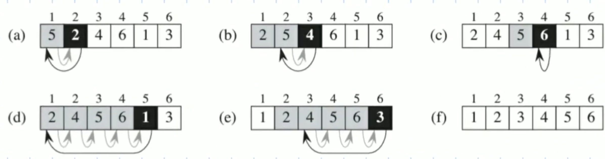
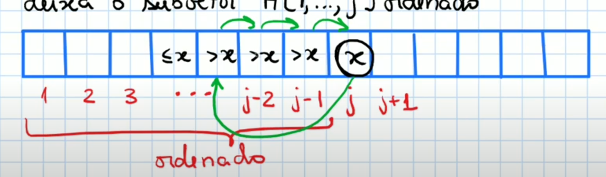

# Insertion Sort
- Forma que muitas pessoas utilizam para ordenar cartas de baralhos
- Começar com uma carta na mao
- Revelar cada uma das outras cartas, uma de cada vez
- Inserir a carta revelada em sua posiçao ordenada



**Problema:** ordenaçao em Vetor
**Entrada:** vetor A, inteiro n

As posiçoes A[1,...,n] contem n valores

**Saida**: permutaçao dos elementos de A tal que estejam ordenados em maneira crescente: 
A[1] <= A[2] <= ... <= A[n]


```pseudocodigo
Algoritmo: InsertionSort(A,n)
para j <- 2,...,n faça
    x <- A[j]
    i <- j-1
    enquanto i >= 1 e A[i] > x faça
        A[i+1] <- A[i]
        i <- i - 1
    A[i+1] <- x
```

## Corretude do InsertionSort
- Mostrar que ele é correto e resolve o problema de ordenaçao
- Provar atraves da invariante de laço

### Invariante de laço
```
Invariante de laço: O subvetor A[1,...,j-1] esta ordenado

Inicio: j = 2 e a invariante diz que o subvetor A[1,...,1 (q é a posiçao j-1)] esta ordenado

Manutençao: 
    1 - invariante vale para um valor j
    2 - Rodar 1 iteraçao do para
    3 - j <- j + 1 (no final do para por baixo dos panos)
    4 - mostrar que a invariante vale com j + 1

Precisamos mostrar que, se subvetor A[1,...,j-1] esta ordenado, 
entao rodando uma iteraçao do para, deixa o subvetor A[1,...,j] ordenado

Termino: j = n + 1
O subvetor A[1,...,n (q é j-1)] esta ordenado    
```
Uma iteraçao do para (Manutençao):
