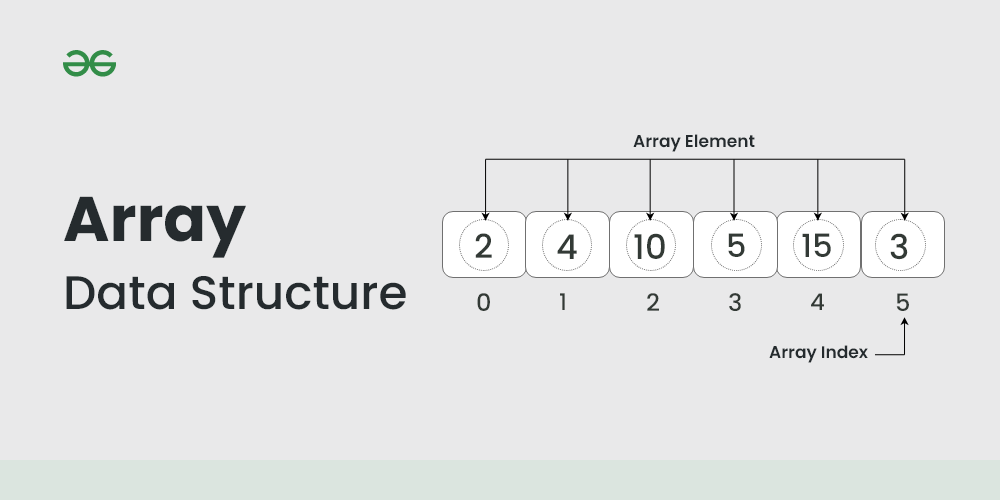

# Arrays

## Caracteristicas
- Um Array tambem conhecido como vetor, é uma estrutura de dados que armazena uma coleçao ordenada de elementos do mesmo tipo.
- Cada ele elemento é acessado atraves de um indice que deve ser um numero inteiro, que representa sua posiçao no array.
- Os indices geralmente começam de 0 e vão ate até o tamanho do array -1.
- Para manipulaçao de determinado elemento em um vetor, precisamos fornecer seu identificador e o indice do elemento desejado
- Sua indexaçao permite acesso a qualquer elemento, em qualquer instante e em qualquer ordem, sem que a sua posiçao no vetor imponha qualquer custo extra de eficiencia.
## Declaraçao de um Vetor
Um vetor é declarado da seguinte maneira:

1. **Nome**: um identificador valido da linguagem
2. **Tipo**: que determina os dados do elementos do vetor
3. **Tamanho**: que delimita quantos elementos pode armazenar
- utilizam-se colchetes na declaraçao e identificaçao de um elemento do vetor.

Exemplos

### **Pseudocodigo:**

v : vetor [0..N] de inteiros

### **Java:**

< tipo>[]< identificador> = new <tipo> [n] 

ou

< tipo> < identificador>[] = new <tipo> [n] 

ou

< tipo> < identificador>[] = {1,2,3,4}

- Nas variaveis declaradas como primitivos sao guardados dados correspondentes ao tipo
- Nos objetos sao guardadas apenas as referencias aos dados.
- Vetores em java sao objetos e, portanto seus indices representam referencias aos objetos construidos pelo operador new, nao aos valores em si.

## Acesso e Atribuiçao de valor ao vetor
### Atribuiçao de valor
Para atribuir valor a um vetor devemos referenciar o index que queremos atribuir valor seguido do valor que deve ser do mesmo tipo do vetor.

**String[] semana = new String[7];**

**semana[0] = "Domingo";**

**semana[1] = "Segunda";**

**semana[2] = "Terça";**

### Acesso ao valor
A leitura, ou o acesso aos valores dos elementos de um vetor, é semelhante a atribuiçao utilizando o index dele para referenciar o dado

**System.out.println("A semana se inicia no " + semana[0])**

## Eficiência e Complexidade

A eficiência e a complexidade de um array referem-se à forma como ele consome recursos computacionais, como tempo e memória, em diferentes operações. Aqui está uma explicação sobre a eficiência e a complexidade de algumas operações comuns em arrays:

### Acesso (leitura/gravação) de elementos:

Eficiência: Geralmente, o acesso a um elemento específico de um array é muito eficiente, pois envolve apenas o cálculo do deslocamento a partir do endereço base do array.
Complexidade: O acesso a um elemento tem complexidade O(1), o que significa que o tempo necessário para acessar qualquer elemento é constante e não depende do tamanho do array.

### Inserção/Remoção de elementos no final do array:
Eficiência: Inserir ou remover elementos no final de um array é eficiente, pois não requer realocação de memória ou reorganização de elementos.
Complexidade: Tanto a inserção quanto a remoção no final do array têm complexidade O(1), desde que haja espaço livre disponível. No entanto, se o array estiver cheio e for necessário redimensioná-lo, a complexidade pode se tornar O(n), onde n é o tamanho atual do array.

### Inserção/Remoção de elementos no início ou no meio do array:
Eficiência: Inserir ou remover elementos no início ou no meio de um array pode ser menos eficiente, pois geralmente requer a realocação de memória e o deslocamento de elementos.
Complexidade: A inserção/remoção no início ou no meio do array tem complexidade O(n), onde n é o número de elementos no array após a operação, devido à necessidade de deslocar os elementos adjacentes.

### Pesquisa (ou busca) linear:
Eficiência: A pesquisa linear envolve iterar através de todos os elementos do array para encontrar o elemento desejado.
Complexidade: A pesquisa linear tem complexidade O(n), onde n é o número de elementos no array, pois pode ser necessário percorrer todos os elementos até encontrar o elemento desejado, ou determinar que ele não está presente.

### Ordenação:
Eficiência: A eficiência da ordenação pode variar dependendo do algoritmo de ordenação utilizado.
Complexidade: Algoritmos de ordenação comuns, como o Quicksort ou Mergesort, têm complexidade O(n log n) em média para ordenar um array de n elementos. No entanto, alguns algoritmos, como o Bubble Sort, têm complexidade O(n^2), o que pode ser menos eficiente para arrays grandes.

**Em resumo, a eficiência e a complexidade de um array dependem das operações realizadas e das características do array, como o tamanho e a quantidade de elementos. É importante considerar esses fatores ao projetar e implementar algoritmos que envolvam o uso de arrays para garantir um desempenho adequado.**
