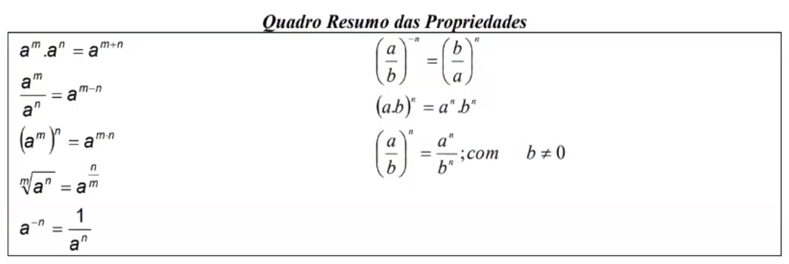
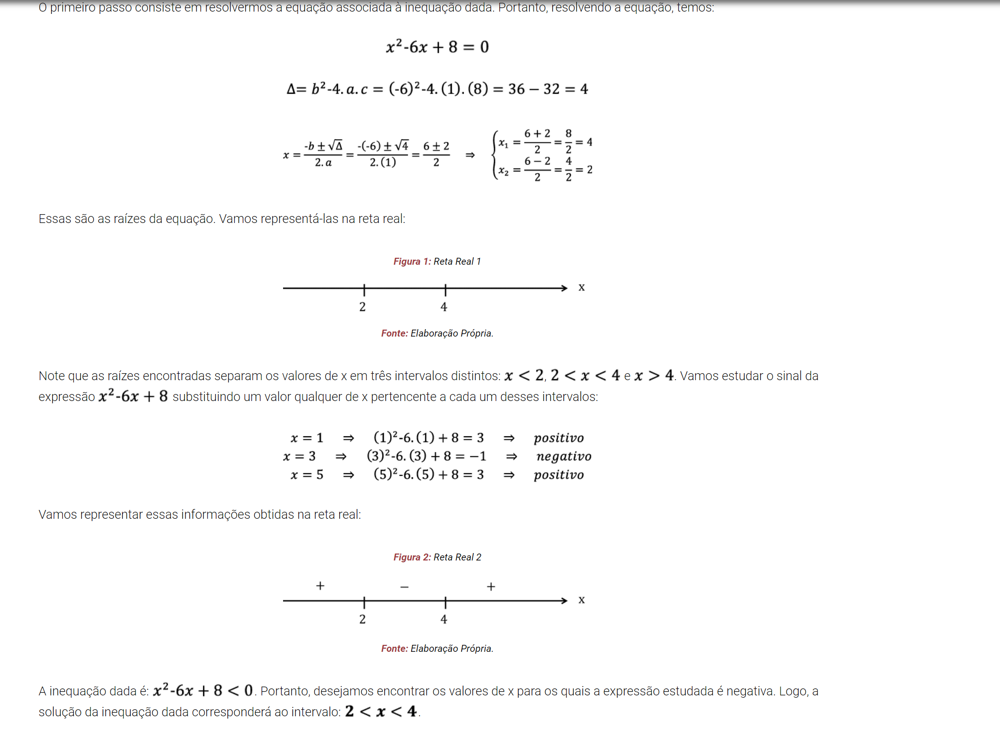
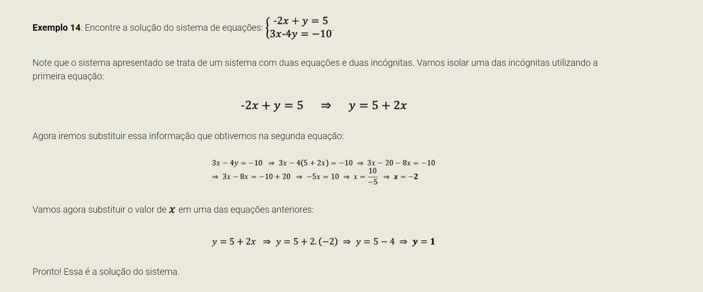
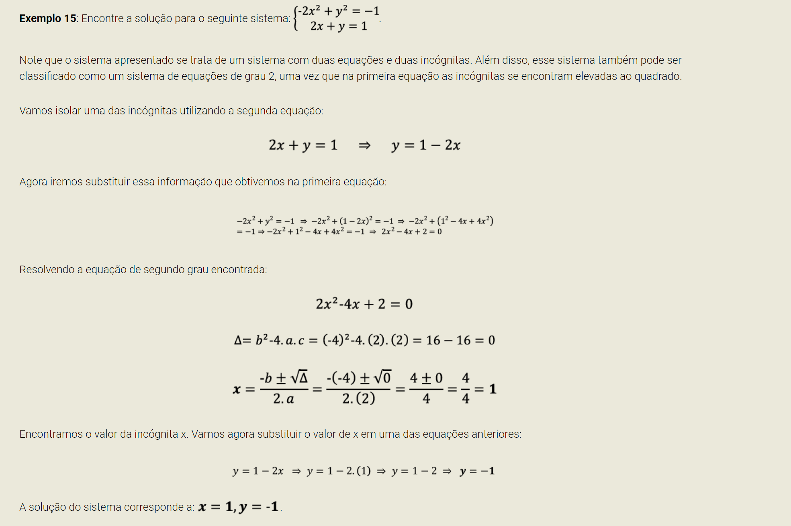
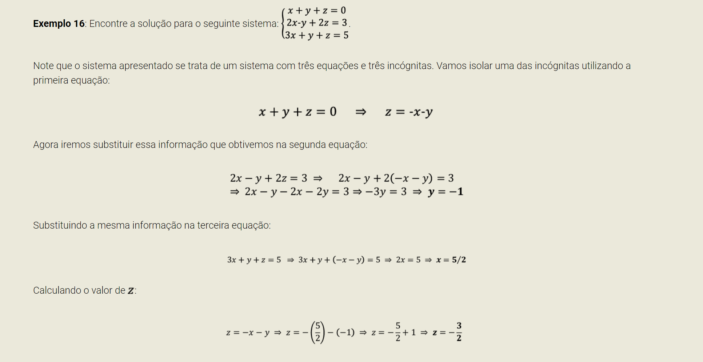

# Introduçao a Matematica Basica

## Numeros Naturais,Inteiros,Racionais e Reais

Um conjunto numerico se trata de um conjunto qualquer cujos elementos sao compostos por numeros.

### Numeros Naturais

* Sao Repesentados pela letra N
* Podem ser definidos da seguinte forma: 
* 
* O conjunto dos naturais é composto por todos os numeros inteiros nao negativos incluindo zero.
* O conjuntos dos naturais nao nulos é composto da seguinte forma: 
* 
* Propriedades
    * O multiplo de um numero natural é sempre natural
    * O conjunto é fechado para a soma(A soma de dois numeros naturais resulta em um numero natural)
    * O conjunto é fechado para a multiplicaçao(O produto de dois numeros naturais resulta em um numero natural)
    * É possivel definir o conceito de sucessor (n+1) e antecessor (n-1).
* Historia:
  * A ideia do numero natural nao é o de um produto puramente do pensamento, independente da experiencia, ou seja, as pessoas nao adquitiram primeiro os numeros para depois contarem
  * Os numeros naturais foram formados lentamente a partir de necessidades praticas por contagem
  * A historia da matematica, nos mostra que a contagem anteceeu a criaçao dos numeros, ou seja, uma contagem por exemplo, de objetos sem a utilizaçao de numeros.

### Numeros Inteiros

* Represendos pela letra Z
* Definidos da seguinte forma: 
* 
* O conjunto dos inteiros é composto por todos os inteiros positivos e negativos, incluindo zero
* O conjunto dos Naturais N, esta contido no conjunto dos inteiros
* Propriedades
  * O multiplo de um inteiro é um inteiro. 
  * Fechado para soma
  * Fechado para a multiplicaçao
* Historia:
  * A partir do inicio do Renascimento surgiu a expansao comercial
  * Aumentou a circulaçao de dinheiro
  * Uso dos simbolos + e - 


### Numeros Racionais

* Representado pela letra Q
* Definidos da seguinte forma: 
* 
* O conjunto dos numeros racionais é composto por todos os numeors que podem ser escritos na forma de uma razao a/b, tal que a seja um numero e inteiro e b seja um inteiro nao nulo.
  * -3/7 (fraçao de inteiros)
  * 0,2 (pode ser escrito como 2/10)
  * 0,33333... (pode ser escrito na forma 0,3333... = 1/3)
* Propriedades
  * Fechado para soma
  * Fechado para a multiplicaçao
  * Todo numero natural e todo numero inteiro é um racional
  * Todo numero que puder ser escrito em forma decimal com um numero finito de casas decimais é racional
  * Todas as dizimas periodicas correspondem a numeros racionais
* Historia
  * Muitas situaçöes cotidianas necessitam de medidas
    * O que medir significa?
      * Comparar grandezas de mesma especie
      * Comparar seria o que se perguntar: quantas vezes um cabe no outro

### Numeros Irracionais

* Representado pela letra I
* Definidos por numeros que sao reais, porem nao sao racionais, ou seja numeros que nao podem ser escritos na forma de uma fraçao envolvendo numeros inteiros
* Exemplos:
  * raiz de 2 = 1,41421356237...
  * raiz de 3 = 1,73205080757...
  * pi = 3,1415926...
* Correspondem a dizimas infinitas e nao periodicas, de forma que nao podem ser representados na forma decimal com exatidao
* Propriedades
  * Incomensurabilidade: Quando dois segmentos de retas sao tais que nao conseguimos, como unidade de medida comum, expressarmos com multiplos inteiros a medida dos dois segmentos, dizemos que eles sao incomensuraveis 
  * Nao é fechado para operaçoes de adiçao e multiplicaçao

#### Operaçoes com numeros irracionais

* Uma vez que numeros irracionais sao compostos por dizimas infinitas e nao periodicas, torna-se impossivel determinados com exatidao o resultado de somas ou ate mesmo produto entre eles.
* É comum deixar indicadas as operaçoes, exemplo:
  * Raiz2 + Raiz3
  * raiz5 X Pi
* Quando for necessarios apresentar a resposta em notaçao decimal, arrendonda-se o numero escolhendo um numero de casas apos a virgula, dessa forma é possivel realizar a operaçao
  * 
  * 
  * Porem o valor é sempre aproximado e nunca exato.

### Numeros Reais
* Representados por R
* Pode ser definido como sendo o resultado da operaçao de uniao entre o conjunto de numeors racionais e o conjunto dos numeros irracionais
* 
* Contem os conjuntos naturais,inteiros,racionais e irracionais.
* Fechado para a soma e para a multiplicaçao
* Os numeros complexos nao fazem parte dos numeros reais.

#### Operaçoes com numeros reais

Uma vez definidos, podem apresentar um conjunto de propriedades fundamentais (axiomas)

* A1. Propriedade associativa da adição
  * 

* A2. Propriedade comutativa da adição
  * 


* A3. Existência do elemento neutro da adição
  * 


* A4. Existência do elemento oposto
  * 


* A5. Propriedade associativa da multiplicação
  * 


* A6. Propriedade comutativa da multiplicação
  * 


* A7. Existência do elemento neutro da multiplicação
  * 


* A8. Existência do elemento inverso
  * 


* A9. Propriedade distributiva da multiplicação sobre a adição
  * 

## Regras de Tres Simples e Composta

* É comum relacionarmos a proporçao entre duas ou mais grandezas

### Proporçao Direta e Indireta

* Grandezas diretas: Acrescimo ou decrescimo de uma equivale ao mesmo processo na outra
* Grandezas inversas: O Aumento ou diminuiçao de uma resultam em processos opostos na outra


### Regras de Tres Simples
Consiste em uma regra que permite efetuar calculos envolvendo duas grandezas proporcionais de maneira eficiente e segura.
Como resolver problemas com essa regra:
1) Monte uma tabela de dados, onde cada grandeza esteja associada a uma coluna da tabela;

2) Determine se as grandezas em questão são diretamente proporcionais ou inversamente proporcionais;

3) Escreva uma equação que expresse a proporção entre as grandezas e encontre sua solução.


#### Exemplo 1 (Proporçao Direta):

Supondo que cada funcionario de uma micropempresa com 35 integrantes gasta 10 folhas de papel diariamente. Quantas folhas serao gastas nessa mesma empresa quando o quadro de colaborades aumentar para 50?

| n colab | n folhas |
|---------|----------|
| 35      | 10       |
| 50      | X        |
Com o aumento de colaboradores ira consumir mais folhas, ou seja a coluna de colaborades é direta com a coluna de folhas
Se as colunas sao diretas, entao mantemos a coluna do x, e trabalhamos com a outra, dessa forma fica 10/x = 35=50, pois nao devemos inverter a segunda
1. 35 * x = 10 * 50
2. 35x = 500
3. x = 500/35
4. x ~= 14 folhas

#### Exemplo 2(Proporçao Indireta):

Se 7 pedreiros constroem uma casa grande em 80 dias, apenas 5 deles construirao a mesma casa em quanto tempo?

Com a diminuiçao de pedreiros, aumento o numero de dias
Como a grandeza é inversa, entao mantemos a coluna do x e invertemos a outra coluna resultando em 80/x = 5/7
1. 5 * x = 80 * 7
2. 5x = 560
3. x = 560/5
4. x = 112 dias

### Regras de Tres Compostas

A regra de tres composta consiste em uma generalizaçao da regra de tres simples para permitir calculos envolvendo tres ou mais grandezas que guardem relaçoes de proporçao entre si.
Como Resolver uma regra de 3 composta:
1) Monte uma tabela de dados, onde cada grandeza esteja associada a uma coluna da tabela;

2) Escolha uma das grandezas do problema para ser sua referência e determine se cada uma das outras grandezas é diretamente proporcional ou inversamente proporcional em relação à grandeza de referência;

3) Escreva uma equação que expresse a proporção entre as grandezas e encontre sua solução.


### Exemplo 1:

Dez guindastes carregam 180 caixas em um navio em 12 dias com 5 horas de trabalho diarias. Quantas vaixas serao carregadas em 15 dias, por 12 guindastes, trabalhando 4 horas por dia?

| n guindaste | n caixas | n dias | n horas |
|-------------|----------|--------|---------|
| 10          | 180      | 12     | 5       |
| 12          | X        | 15     | 4       |

Com o aumento de guindastes temos aumento de caixas, entao a coluna de caixas é diretamente proporcional
Com o aumento de dias produzimos um aumento no numero de caixas, entao tambem sao diretamente proprocional
Com a diminuiçao do numero de horas, iremos produzir menos caixas, entao tambem é diretamente proporcional


Mantem a coluna do x como esta, todas as diretamente proporcionais tambem sao mantidas, dessa forma ficara 180/x = 10/12 * 12/15 * 5/4

1. 180/x = 10*120*5/12*15*4
2. 180/x = 600/720
3. 600x = 129600
4. 6x=1296
5. x=1296/6
6. x=216 caixas


## Potenciaçao
A operaçao envolvendo potencias pode ser definida a partir da operaçao de de multiplicaçao entre numeros. Sua definiçao pode ser apresentada de acordo com a relaçao: a^n=a X a X a X ... X a (n vezes)
Onde o numero a é chamado de base e o numeo n é chamado de expoente. Para calcular o valor de a^n devemos efetuar uma multiplicaçao sucessiva do valor a, onde o fator a deve aparecer n vezes.

Ex: 3^4 = 3x3x3x3 = 81

### Resumo das propriedades


### Exemplo 1
Utilizando as propriedades de potenciação, simplifique a seguinte expressão e calcule o seu valor:
* 
* Vamos inicialmente escrever todas as potências da expressão na forma de base dois:
* 
* Agora iremos utilizar as propriedades operatórias a fim de simplificar a expressão:
* 


## Equaçoes e Inequaçoes

* Qualquer relaçao algebrica que envolva uma igualdade matematica (=)
* Marcada pela existencia de um ou mais valores desconhecidos, chamados de incognitas
* Resolver uma equaçao consiste em utilizar propriedades algebricas para determinar os possiveis valores das incognitas de modo a satisfazer a relaçao proposta
* No caso das inequaçaos, temos uma estrutura parecida, porem, ao inves de possuirmos uma relaçao de igualdade, teremos uma relaçao que utiliza dos seguintes simbolos: >,<,>=,<=,!=

### Equaçoes de Primeiro Grau

* Qualquer equaçao que possa ser escrita na forma: ax + b = 0, onde a e b sao numeros reais com a != 0
* O processo de resoluçao desse tipo de equaçao envolve isolar a incognita a fim de descobrir seu valor:

#### Exemplo 1 
Resolva a seguinte equaçao 2x + 14  = 0
```
2x + 14 = 0
2x = -14
x = -14/2
x = -7
```
#### Exemplo 2
Resolva a seguinte equaçao -(1/2)x + 3 = 0
```
-(1/2)x + 3 = 0
-(1/2)x = -3
(1/2)x = 3
1x = 3 * 2
x = 6
```
### Inequaçoes de Primeiro Grau
* Do ponto de vista estrutural, uma inequaçao é bastante semlhante a uma equaçao
* O processo de resoluçao desse tipo de equaçao envolve isolar a incognita a fim de descobrir seu valor
* Existe uma propriedade que nos diz que sempre que multiplicarmos uma inequação por um número negativo devemos inverter o símbolo da desigualdade. Observe:
* 

#### Exemplo 1
Resolva a seguinte inequaçao: 5x-1 <= 0
```
5x-1 <= 0
5x <= 1
x <= 1/5
```

#### Exemplo 2
Resolva a seguinte inequaçao: -2x-3 <= 0
```
-2x-3 <= 0
-2x <= 3
2x >= -3
x >= -3/2
```

### Equaçoes de Segundo Grau
* Consiste em qualquer equaçao que possa ser escrita na forma ax^2 + bx + c = 0, onde a b e c sao numeros reais, sendo que a deve ser um real nao nulo.
* Para encontrarmos as soluçoes de uma equaçao de segundo grau, usa-se a formula de bhaskara:
* 
* O parametro delta é chamado de discriminante

#### Exemplo 1 
Resolva a equaçao: -x^2 + 5x - 6 = 0

Nota-se que: a = -1, b = 5, c = -6

-x^2 + 5x - 6 = 0
Utilizando as equações já apresentadas, temos:
* 

#### Exemplo 2
Resolva a equaçao: 2x^2 + 4x + 2 = 0
* 

### Inequaçoes de Segundo Grau
* Do ponto de vista estrutural, uma inequaçao é bastante semlhante a uma equaçao
* Para resolvermos esse tipo de inequação, iremos inicialmente encontrar as soluções da equação de segundo grau associada e, posteriormente, realizar um estudo de sinal a fim de determinar os intervalos a serem apresentados como solução da inequação. Esse procedimento poderá ser observado a seguir:

#### Exemplo 1
Encontre a soluçao da seguinte inequaçao: x^2 - 6x +8 < 0




## Resoluçao de Sistemas de Equaçoes

Um sistema de equaçoes se trata na verdade de um conjunto de equaçoes. A soluçao consiste em um conjunto de valores que as incognitas devem assumir a fim de que todas as equaçoes sejam satisfeitas simultaneamente

### Metodo da substituiçao
1) Utilize uma das equações do sistema para isolar uma das incógnitas do problema;

2) Substitua a expressão obtida para essa incógnita na outra equação e resolva-a encontrando uma das incógnitas;

3) Substitua o valor da incógnita encontrada em uma das equações do sistema para a determinação da outra incógnita.

Esse roteiro leva em conta a resolução de um sistema de duas equações e duas incógnitas, mas esse princípio pode ser facilmente adaptável para a resolução de outros tipos de sistema. Observe os exemplos apresentados a seguir:

### Exemplo 1


### Exemplo 2


### Exemplo 3
