# Funçao

## Funçao Afim e Funçao Quadratica

### Funçao Afim
* Uma funçao afim ou funçao de primeiro grau, relaciona-se com qualquer funçao que possa ser escrita da seguinte forma: y = ax + b
* Onde "a" corresponde a um numero real nao nulo e "b" corresponde a numero real qualquer.
* Intercepto: interceptos correspodem aos pontos onde o grafico da funçao corta um dos eixos coordenados
  1) Coloque zero no valor da variavel x e descubra o valor de y correspondente
  2) Coloque zero no valor da variavel y e determine o valor de x correspondente

#### Exemplo 01:
Encontre os interceptos para a função afim y= 2x - 6

* x = 0: y = 2.(0) - 6 -> y = 0 - 6 -> y = -6 -> ponto (0,-6) 
* y = 0: 0 = 2x - 6 -> 6 = 2x -> 6/2 = x -> x = 3 -> ponto (3,0)
* O grafico asssociado a uma funçao afim sempre correspondera a uma reta, porntato, se tivermos os interceptors associados a uma funçao, pode-se desenhar seu grafico com facilitade, bastanto apenas representar os interceptors no grafico e traçar uma reta entre eles.
* 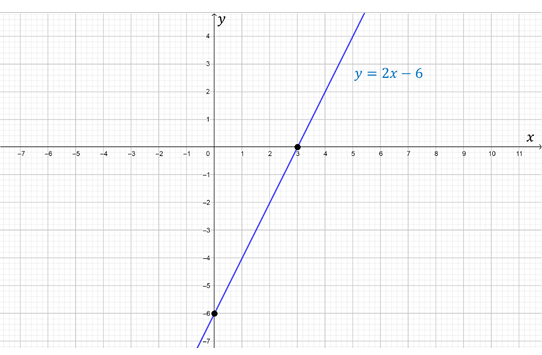

#### Coeficiente Angular
Coeficiente Angular: (parametro a), ao considerar uma funçao linear de forma y = ax + b, o valor do parametro esta associado a inclinaçao do grafico (reta).
* 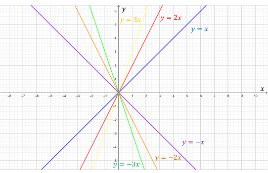
* Diferentes valores do parametro a mudam o compartamento da funçao, ele se relaciona com a inclinaçao da reta, ou seja, quanto maior o seu valor, mais inclinado sera o grafico da funçao, para valores positivos a reta sera crescente e para negativos decrescente.

### Coeficiente Linear
Coeficiente Linear: (parametro b), se relaciona com o ponto onde a reta cruza o eixo vertical y
* 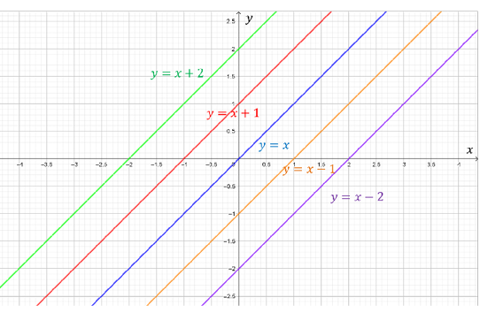
* No grafico é possivel observar que a reta y = x + 2 toca o eixo y no ponto 2, ja a reta y = x - 1 cruza o eixo vertical exatamente no ponto -1.

### Funçao Quadratica
* Funçao Quadratica ou funçao de segundo grau, relaciona-se com qualquer funçao que possa ser escrita da seguinte forma: y = ax^2 + bx + c
* Onde "a","b" e "c" correspondem a um numero real, sendo "a" nao nulo.
* O grafico de uma funçao de segundo grau corresponde a uma curva, conhecida como parabola

#### Concavidade:
A concavidade de uma parabola estarelacionada ao parametro "a" que compoe a funçao.
* 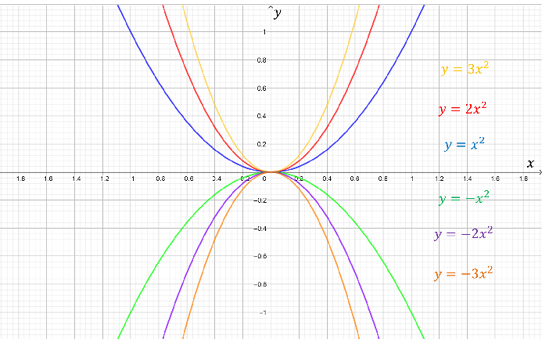
* Se o valor de "a" for positivo a concavidade fica voltadas para cima, se for negativo ficam voltadas para baixo
* Quanto maior o valor de a (em modulo) mais concava sera a parabola obtida.

#### Raizes de uma funçao quadratica
As raizes correspondem ao ponto o grafico da funçao "corta" o eixo x. 
* Para obtermos as raizes da funçao, devemos iguala-la a zero, resolvendo a equaçao de segundo grau.

##### Exemplo Raizes

Encontre as raizes para a funçao y = x^2 - 6x + 5
* 
* 
* portanto, x`= 5 e x`` = 1, sao as raizes da funçao y = x^2 - 6x + 5

#### Vertice
O ponto do vertice (V) associado a uma funçao quadratica pode ser obtido facilmente por meio da seguinte expressao:
* 
* O vertice de uma parabola sempre correspondera ao ponto maximo ou de minimo de uma funçao quadratica, dependendo da sua concavidade
  * se a > 0, a parabola é concava pra cima, e o vertice correspondera ao ponto minimo da funçao
  * se a < 0, a parabola é concava pra baixo, e o vertice correspondera ao ponto maximo da funçao

#### Esboçando o grafico de uma parabola
Qualquer parabola pode ser esboçada conhecendo-se suas raizes e as coordenadas do seu vertice. Para a funçao quadratica estudada anteriormente, sabe-se que as raizes se encontram nos ponto x`=5 e x`` =1, e o vertice corresponde ao ponto V=(3,-4)
* 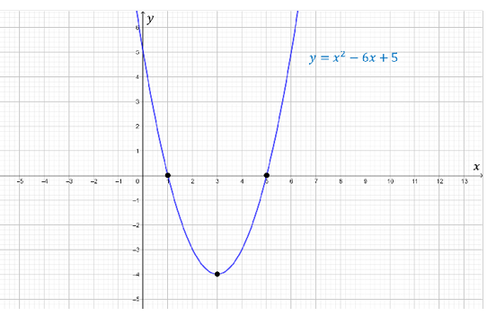

##### Exemplo Vertice
Calcule o vertice para a funçao y = x^2 -6x + 5, utilizando as informaçoes ja obtidas anteriormente
* 
* Logo V = (3,-4) corresponde ao vertice da parabola para a funçao dada
* 

## Funçao Exponencial e Logaritmica

### Exponencial
* A funçao exponencial se trata de qualquer funçao que possa ser escrita na seguinte forma: y = a^x
* Onde "a" correspondem a um numero real positivo diferente de 1
* Segue um grafico para a funçao exponencial y = 2^x
* 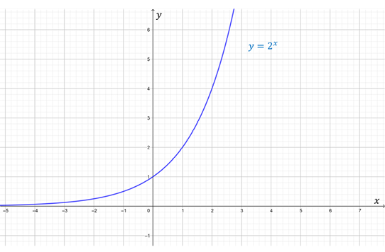
* O grafico acima retrata o comportamento de uma funçao exponencial crescente
  * para valores de x cada vez mais negativos, podemos notar que a funçao progressivamente vai ser aproximando do eixo y
  * A funçao cruza o eixo y no ponto (0,1) 
  * conforme os valores de x começam a crescer, temos um crescimento explosivo na funçao
* As funçoes exponenciais possuem um crescimento intenso e explosive para valores elevados da variavel x, como por exemplo o calculo do valor funçao y=2^x
  * 
* O parametro "a" (base da funçao) tambem possue um impacto no grafico
  * 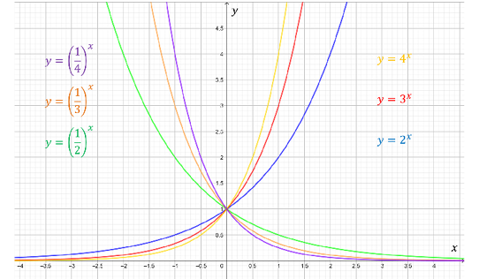
  * para valores maiores que 1, temos uma curva exponencial crescente
  * para valores situados entre 0 e 1, temos uma curva exponencial decrescente
  * todas as funçoes intercepta o eixo vertical y no ponto (0,1)

### Logaritmicas
* Qualquer funçao que pode ser escrita na seguinte forma
  * 
* Onde "a" corresponde a um numero real positivo e diferente de 1
* A funçao logatirma corresponde á inversa da funçao exponencial, valendo a seguinte propriedade fundamental:
  * 

#### Calculos Logaritmos
* 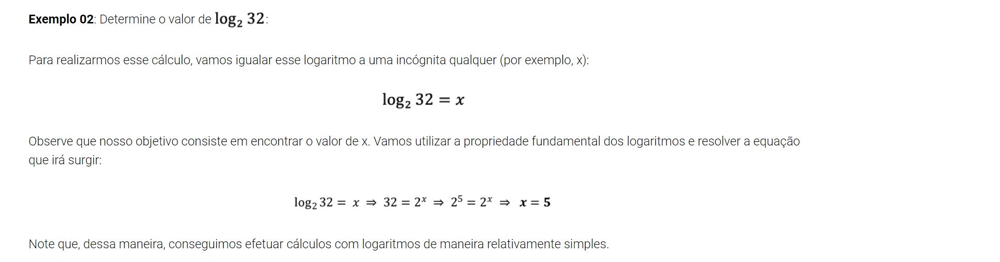
* 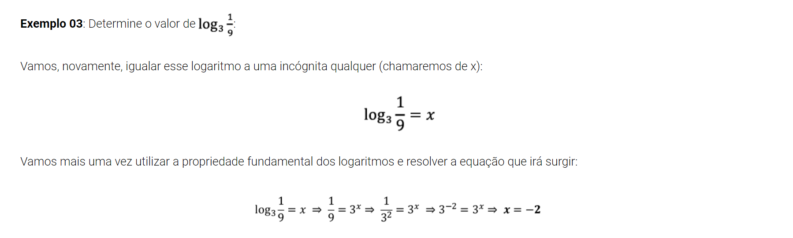
* 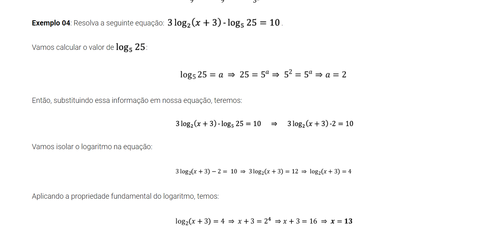

#### Propriedades Graficas
Segue grafico para a funçao logaritmica: 
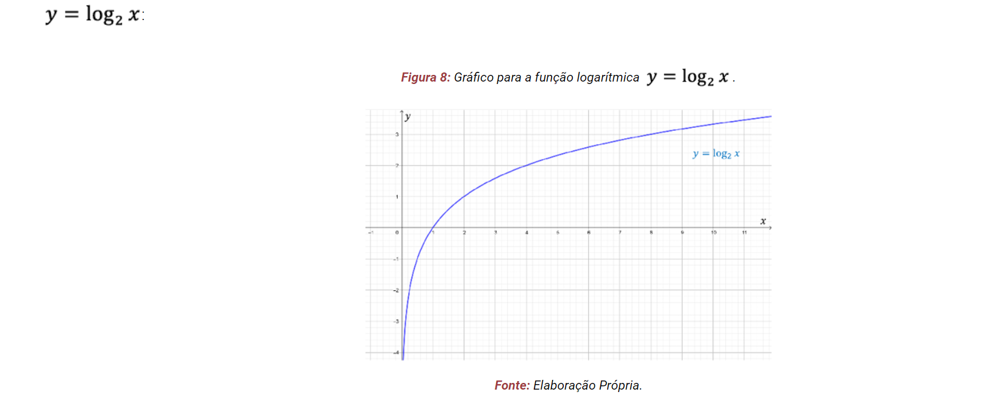
* O grafico retrata o comportamento de uma funçao logaritmica crescente
* Para valores que x se aproxima de zero pode-se notar que a funçao progressivamente vai se aaproximando do eixo y
* A funçao cruza o eixo x no ponto (1,0)
* Conforme os valores de x começar a crescer, a funçao apresenta uma taxa de crescimento cada vez menor

* O impacto que o parametro a (base da funçao logaritma) exerce no grafico:
  * 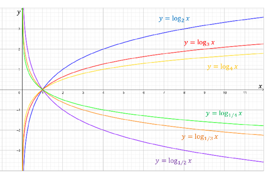
* Pode-se ver que para valores do parametro "a" maiores que 1, temos uma curva logaritmica crescente
* Ja para valores situados entre 0 e 1, temos uma curva logaritmica decrescente
* Quanto maior o valor do parametro a, menor sera o valor da funçao para valores elevados de x
* Todas as funçoes logaritmicas interceptam o eixo horizontal x no ponto (1,0)

## Funçoes
Funçoes comumente utilizadas em estudos na area de ciencias economicas, fornecem informaçoes basante uteis que possibilitam a compreensao de alguns mecanismos basicos em economia, tais como o resultado financeiro de um empreendimento, ou processo de formaçao de preços de um determinado bem ou produto.

### Funçoes Receita, Custo e Lucro
As funçoes receita, custo e lucro sa ode importancia fundamental para a compreensao da situaçao financeira de qualquer empresa ou negocio proprio.

#### Receita
* Considere a situaçao em que determinada empresa, que vende determinado produto, efetua em um dado periodo a venda de x unidades desse produto a umm dado preço que chamaremos de p
* Dizemos que a receita obtida com essa operaçao se relaciona com o valor total que sera obtido com a venda, ou seja o faturamento bruto da empresa
* A funçao Receita pode ser expressa da seguinte forma
  * 
  * Se a empresa vende x unidades de um produto a um preco p, a receita consistira na multiplicaçao do numero de produtos vendidos (x) pelo preço de venda de cada produto (p)

#### Custo
* Entende-se custoo valor total de todos os gastos associados a produçao de um bem.
* No custo estao incluidos gastos diretos e indiretos
* A funçao Custo pode ser expressa da seguinte forma:
  * 
  * É composta por duas parcelas
    * o valor de Cf esta associado aos custos fixos
    * o valor de Cv(x) esta associado aos custos variaveis do negocio, que possui relaçao com numero de produtos vendidos (x)

#### Lucro
* Corresponde ao valor obtido por meio da receita que ira restar apos o pagamento de todos os custos
* A funçao lucro pode ser expressa da seguinte forma:
  * 
  * O lucro é dado por uma operaçao de subtraçao envolvendo a receita e os custos

#### Exemplo
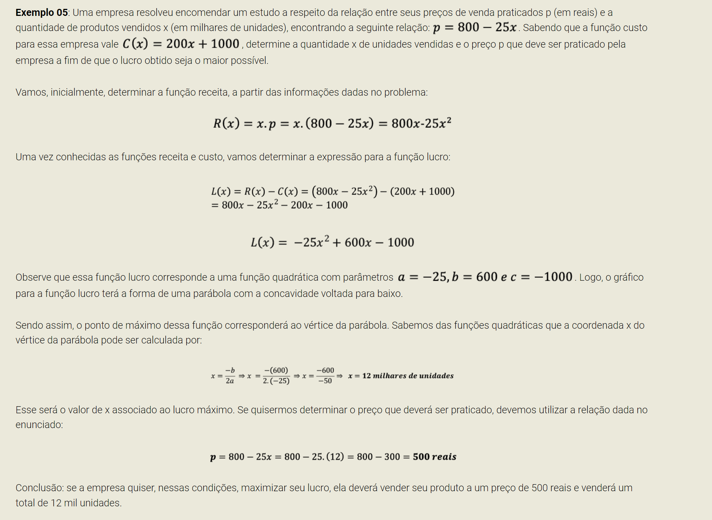

### Oferta e Demanda

Outras duas funçoes de grande importancia no estudo economico sao as funçoes oferta e demanda

#### Funçao Demanda D(p)
* A funçao demanda é uma funçao associada ao comportamento do consumidor
* Ela relaciona a quantidade demandada D de um determinado produto com seu preço de venda p
  * O preço de um produto influi diretamente em sua demanda, 
    * por exemplo se um produto se torna muito caro a demanda por esse produto ira diminuir
    * Ja se o preço de um produto cai, ele se torna mais acessivel, criando um aumento de demanda por parte do publico consumidor
* A funçao demanda D(p) é uma funçao decrescente.

#### Funçao Oferta O(p)
* A funçao oferta é uma funçao associada ao mercado produtor de um determinado bem.
* Ela relaciona a quantidade ofertada de um dado produto O com seu preço p
  * A oferta de um produto esta intimamente associada aos preços que serao praticados
    * Por exemplo, se um determinado produto tiver um preço de mercado muito elevado, isso fara com que os produtores aumentem a oferta desse produto, afim de aumentar seus lucros
    * Ja se o preço de um determinado bem estiver excessivamente baixo, isso pode fazer com que os produtores nao ofertem esse tipo de bem, pois suar margens de lucro serao baixas
* A funçao oferta O(p) é uma funçao crescente

#### Ponto de Equilibrio

A figura a seguir ilusta a venda de um produto, con suas respectivas curvas de oferta e demanda
* 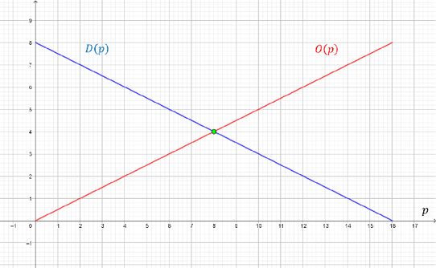
* Observe que temos funçoes de oferta e demanda no grafico
* Ponto de Equilibrio corresponde ao preço p onde o valor da funçao oferta se iguala ao valor da funçao demanda.
  * Graficamente esta associado a intersecçao das duas funçoes
  * Note que no grafico anterior o ponto de equilivro se encontra a um preço p=8
* De um ponto de vista economico o preço desse produto ira tender ao valor 8
  * Se estiver a esquerda do ponto de equilibrio, teremos uma situaçao em que os preçoes estao baixos, com uma demanda que é superior a oferta
    * se esse produto possui uma demanda muito superior a oferta, seu preço tende a aumentar, assim voltando ao ponto de equilibrio
  * Se estiver a direita do ponto de equilibrio, teremos uma situaçao em que os preços estao altos, com baixa demanda e grande oferta
    * Se a demanda é baixa e a oferta alta, o preço tende a cair de modo a retornar ao ponto de equilibro

  
#### Exemplo
* 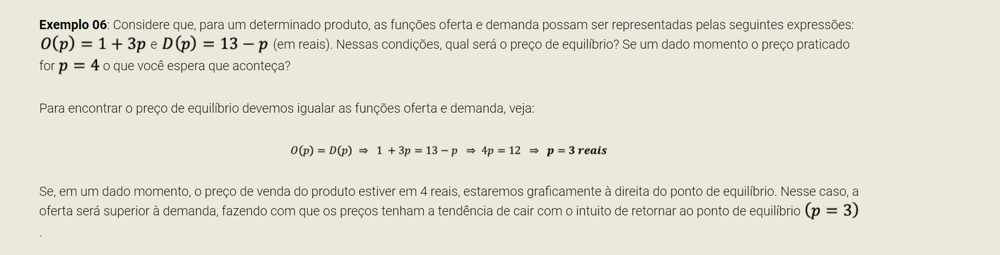

## Esboço de Graficos de Funçoes
 Aspectos adicionais que irao ampliar as possibilidades no que diz respeito a capacidade de esboçar graficos de funçoes, a ideia é esboçar graficos de funçoes a partir de graficos basicos ja conhecidos, para isso serao utilizados os efeitos graficos.

### Deslocamentos Verticais
* Somar ou subtratir um valor constante a uma funçao, ira promover um deslocamento vertical do grafico dessa funçao
* Usando como exemplo a funçao y = x^2, ao somar ela com +3, deixando como y = x^2 + 3, o grafico fica da seguinte forma:
* 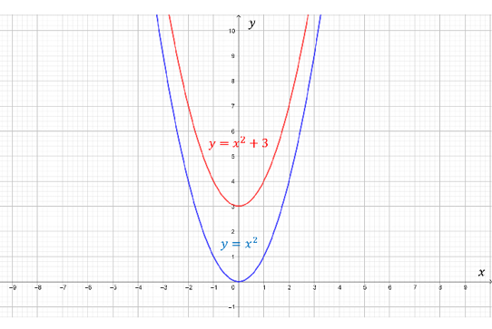

### Deslocamentos Horizontais
* Somar ou subtrair um numero dentro de uma funçao ira promover um deslocamento horizontal do grafico da funçao.
* Usando como exemplo a funçao y= X^2, se somarmos ou subtrairmos 3 dentro da funçao, y= (x + 3)^2, entao moveriamos ao grafico na horizontal
* 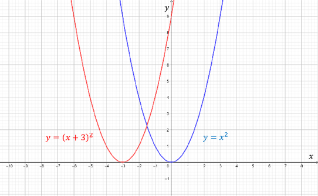

### Reflexoes no Eixo X
* Ao acrescentarmos um sinal negativo a frente da funçao, produziremos uma reflexao do grafico da funçao em relaçao ao eixo x, que se comporta como se fosse um espelho que reflete o grafico da funçao original
* Usando como exemplo a funçao y = 2^x, ao adicionarmos um sinal negativo na frente y = -2^x:
* 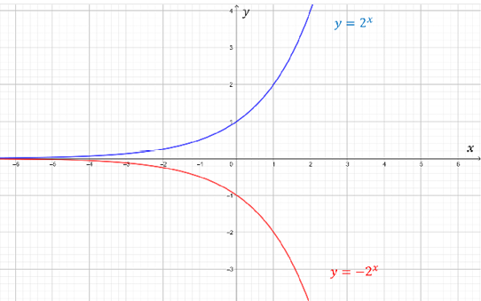

### Reflexoes no Eixo Y
* Ao acrescentarmos um sinal negativo dentro da funçao, produziremos uma reeflexao do grafuco da funçao em relaçao ao eixo y.
* Usando como exemplo a funçao y = 2^x, ao adicionarmos um sinal negativo dentro da funçao, y=2^-x, entaoo grafico fica da seguinte forma:
* 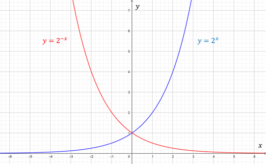

### Esticamentos Verticais
* Multiplicar uma parabola por determinado numero faz com que ela seja esticada verticalmente
* Usando como exemplo a parabola y = 4-x^2, ao multiplicarmos ela pelo numero 2, faz com que o vertice da parabola seja esticada verticalmente em um fator 2, ou seja o vertice que se encontrava no ponto (0,4) agora esta no ponto (0,8)
* 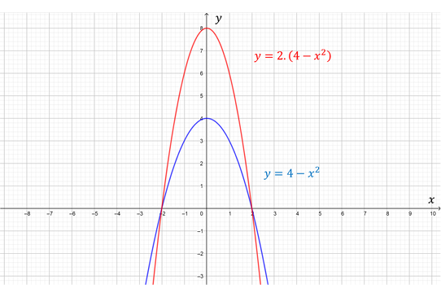

### Compressoes Horizontais
* Multiplicar um valor dentro de uma parabola, acabamos por comprimir horizontalmente a funçao.
* Usando um exemplo onde a parabola y=17-x^2, multiplicado por dois dentro dela ficando y=16 - (2x)^2, as raizes que antes possuiam valores +-4 agora passam a assumir os valores +-2
* 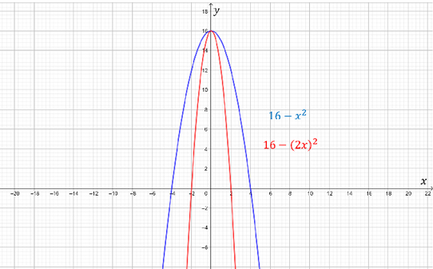
* 
### Juntando Tudo
* 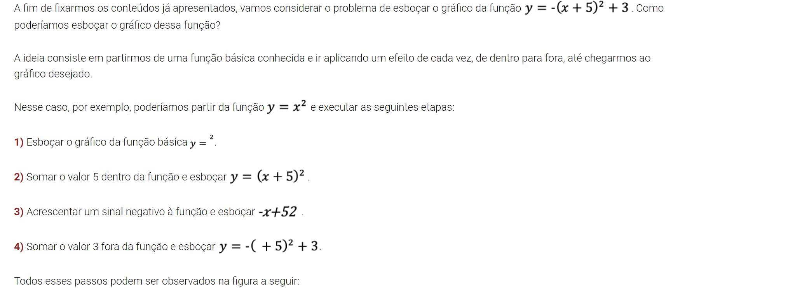
* 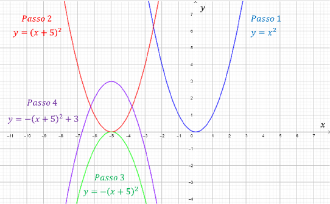
