# Probabilidade e Estatistica

## Estatistica

* A estatistica é uma ciencia cujo principal objeto de estudo sao os dados. Esses dados sao colhidos, analisados e interpretados por meio de ferramentas estatisticas.
* Apos o uso da estatistica, somos camapzes de tomar as decisoes necessarias com base na interpretaçao correta dos dados.
* A estatistica é uma ferramenta importante para tomadas de decisoes, e deve ser usada como uma ciencia-meio, ou seja uma ciencia de apoio a outros campos de conhecimento, e nao uma ciencia-fim.
* Em geral trabalha-se com dois tipos de dados na estatistica
  * Populaçao ou universo: coleçao de todos, resultados, mediçoes ou contagens do nosso interese
  * Amostra: subconjunto ou parte de uma populaçao
* Exemplo de populaçao e Amostra 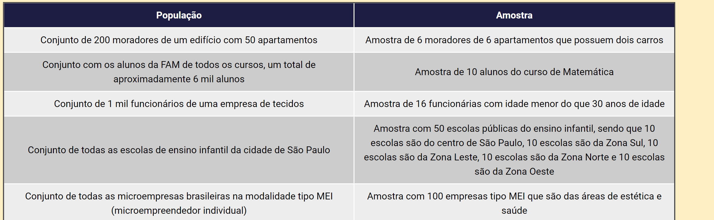
* A estatistica é dividade em duas partes a fim de facilitar os estudos
  * Estatistica Descritiva: sua preocupação é descrever e organizar os dados experimentais.
  * Estatistica Indutiva: sua finalidade é cuidar da analise e interpretar os dados
  * 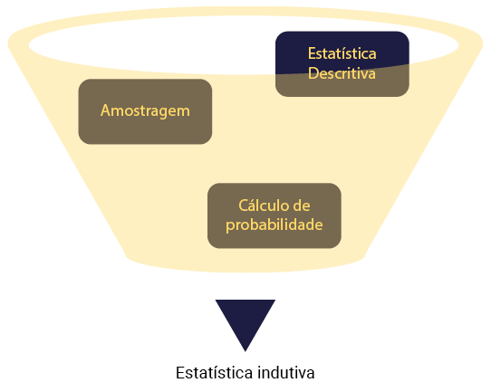
  * Com base na figura, podemos dizer que coletamos amostras de uma populaçao, nosso objeto de estudo. Feito isso usamos a estatistica descrita, que nada mais é do que "o ramo da estatistica que envolve a organizaçao, o resumo e a apresentaçao dos dados"
  * Apos darmos o tratamento da estatistica descritiva aos dados, fazemos uso da estatistica indutiva, a qual "consiste em um ramo da estatistica que envolve o uso de uma amostra para chegar a conclusoes sobre uma populaçao", ela utiliza-se do calculo de probabilidades
  
### Exemplo de Estatistica
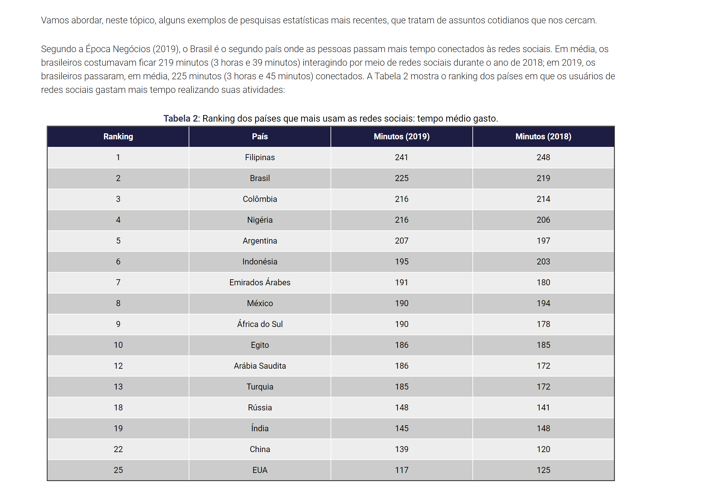

### Medidas de Localizaçao e Dispersao

* As medidas de tendencia central, representam um conjunto de dados atraves de um unico valor, no qual os dados tendem a se concentrar.
* Essas medidas sao: Medias, Moda e Mediana.

#### Media
* Media Aritmetica (Media = x̅) -> Obtida pela somatorio dos elementos de cada conjunto dividida pelo numero total de elementos.
* Media Simples: somamos todos os valores do conjunto, e dividimos pelo numero de valores contidos no conjunto.
  * Ex:
    * A) 2,8,7,4,9: Media = (2+8+7+4+9)/5 = 30/5 = 6.
* Media Ponderada: Toda vez que obtivermos frequencia ou peso, calcula-se a media somando as multiplicacoes dos valores base * os pesos e dividindo pelo total do conjunto 
  * Ex:
    * B)
    * | Nota | Alunos | 
      |------|--------|
      | 8    | 3      |
      | 9    | 5      |
      | 10   | 2      |
    * Media = (8 * 3 + 9 * 5 + 10 * 2)/(3 + 5 +2) = (24 + 45 + 20)/10 = 89/10 = 8,9.

* Formula/Somatoria:
* 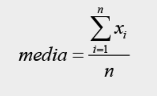
* E -> Letra Sigma
* i -> indice inicio
* n (superior) -> indice fim
* xi -> a forma da soma, os valores do conjunto
* n (inferior) -> divisao da formula, nao tem relaçao com a somatoria.
* No caso da imagem temos: indice inicio 1, indo ate o total do conjunto, somando cada numero individualmente
* Ex: 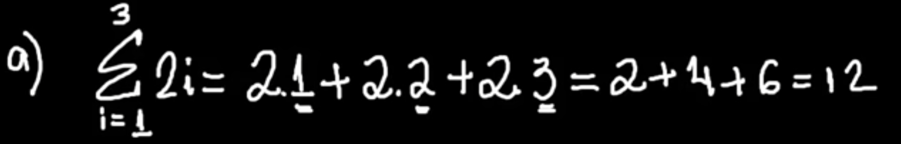

#### Moda
* Moda é o elemento que mais aparece
* Ex: 
  * A) 2,4,5,5,7: moda=5 (unimodal, apenas uma moda)
  * B) 3,4,4,8,8: moda=4,8 (bimodal, duas modas)
  * C) 3,3,4,4,5,4: moda= (amodal, nao possui moda pois tem que ter algum elemento com quantidade inferior)

#### Mediana
* Mediana, é uma medida de localizaçao, que ocupa posiçao central da serie de observaçoes, quando eles estao organizados em ordem crescente.
* Organizar em rol, em ordem crescente, do menor para o maior
* Formula
* 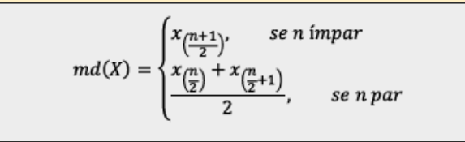
* Ex:
  * A) 5,7,4,5,7. -> Rol: 3,4,5,7,7
    * Mediana = Quando for impar é a posiçao do meio, no caso 3 posiçao, valor 5.
  * B) 5,5,8,4,3,2. -> Rol: 2,3,4,5,5,8
    * Mediana = Quando for par, a mediana é a media aritmetica dos numeros do meio, no caso (4 + 5)/2 = 9/2 = 4,5

### Medidas de Dispersão
* Medidas media e mediana nao falam nada sobre a variabilidade dos dados, assim para estudar um conjunto de dados é necessario definir outras medidas, denominadas medidas de dispersiao.
* Sao medidas que medem a variabilidade dos dados ou a dispersao presente nos dados
* As mais usadas sao amplitude, variancia, desvio-padrao e o coeficiente da variacão.

* 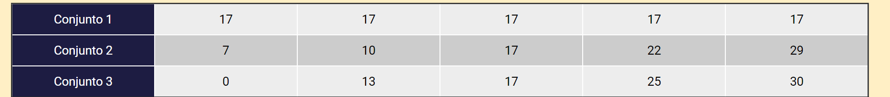
* Medias: M1 = 17;M2 = 17; M3=17
* Mediana: M1 = 3 pos=17;M2 = 3 pos=17;M3 = 3 pos=17;
* Moda: M1 = 17; M2 = N/A; M3 = N/A
* Como observa-se na imagem abaixo, embora os conjuntos tenham a mesma media e a mesma mediana, possuem um aspecto diferente olhando a variabilidade ou a dispersao:
* 
* 
#### Amplitude
* A diferença existente entre o maior e o menor valor entre os dados que foram apresentandos.
* Formula:
* 
  * R = amplitude.
  * xmáx = valor máximo da série de dados.
  * xmín = valor mínimo da série de dados.
 
Façamos o cálculo da amplitude para os 3 conjuntos de 5 elementos. Com isso, para o Conjunto 1 temos:

R1 = xmáx–xmin

R1 = 17–17

R1 = 0

Para o Conjunto 2 temos:

R2 = xmáx–xmin

R2 = 29–7

R2 = 22

Para o conjunto 3 temos:

R3 = xmáx–xmin

R3 = 30–0

R3 = 30

Com base nos cálculos anteriores, podemos dizer que o Conjunto 3 apresentou a maior amplitude em seus dados.

#### Variancia
* Usada para saber como a distribuiçao de valores ocorre em uma amostra ou na populaçao como um todo.
* A variancia é expressa na unidade da variavel elevada ao quadrado.
* Formula Variancia Amostra
  * 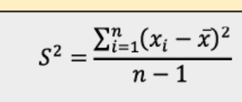
* Formula Variancia Populaçao
  * 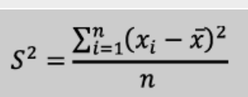

Ex Calculo Variancia Amostras
* OBS: onde esta xi = x_ deveria ser x1 - x_.
* 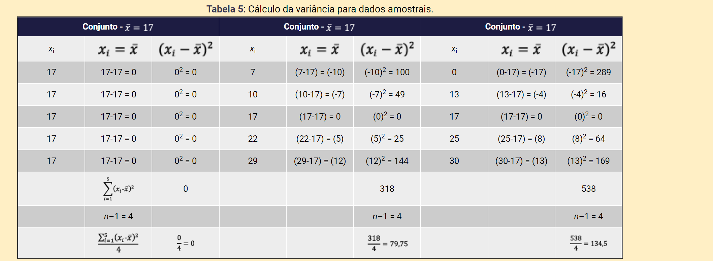

Ex: Caclulo Variancia Populaçao
* OBS: onde esta xi = x_ deveria ser x1 - x_.
* 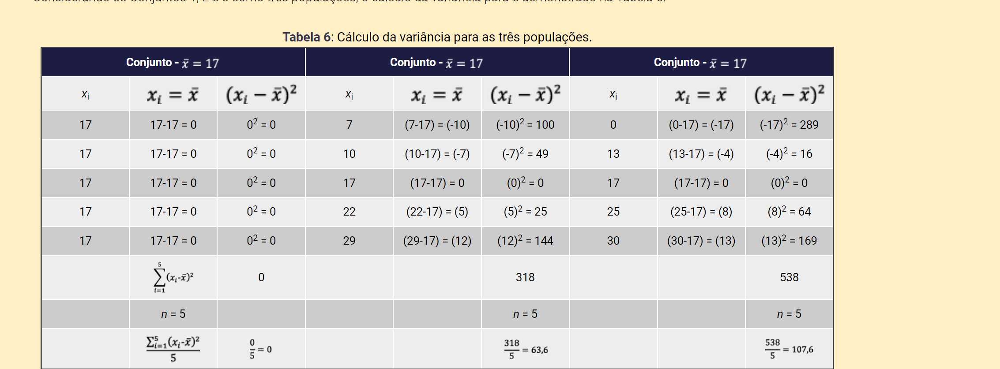

#### Desvio-Padrao

* O desvio-padrao é definido como a raiz quadrada positiva da variancia
* Formula:
  * 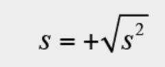
* Ex:
  * 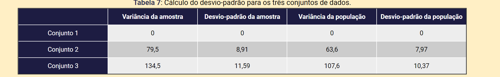
* O desvio padrao informa o quanto os dados estao longe da media, no conjunto 1 os dados sao iguais a media 17; no conjunto 2 os  dados estao 8,93 unidade da media para a amostra; no conjunto 3, os dados encontram-se a uma distancia de 11,59 unidades da media para a amostra e 10,37 unidades da media para a populaçao

#### Coeficiente da Variaçao
* O coeficiente da variaçao é definido como o quaociente entre o desvio padrao s e a media x_.
* é um numero adiminensional que costumamos mulltiplicar por 100 para te-lo em porcentagem.
* O coeficiente da variaçao (CV) nos mostra o quanto os dados tem variado em relaçao a media em termos relativos.
* Formula:
  * 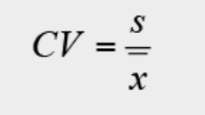
* Ex:
  * 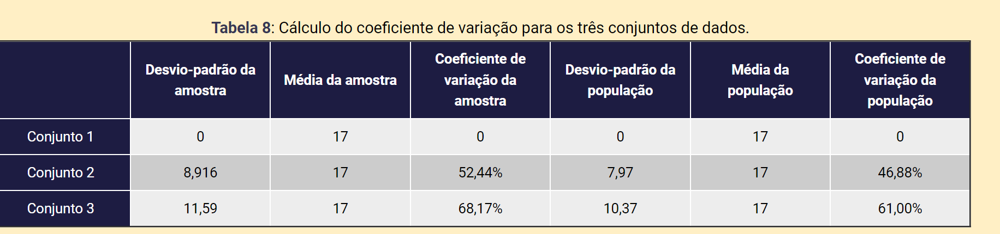
  * Observando a tabela, percemos que os dados apresentam maior coeficiente de variaçao quando consideramos os tres conjuntos de dados como amostras.

#### Sumario Estatistico

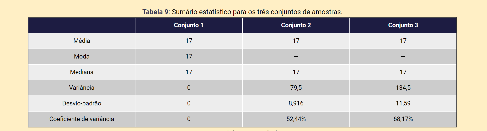
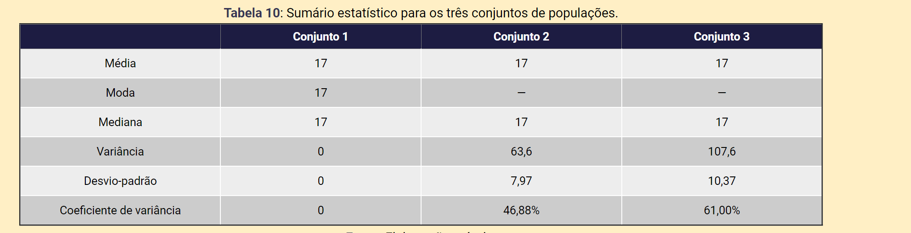

## Frequencias e Classes
* A distribuiçao das frequencias nada mais é do que uma tabela simples que nos mostra como a variavel se dissipa de acordo as divisoes estabelicidas por nos (classes).

### Tabela de Frequencia

Baseado na seguinte tabela que contem niveis de glicoses em 60 crianças, ja ordenada:
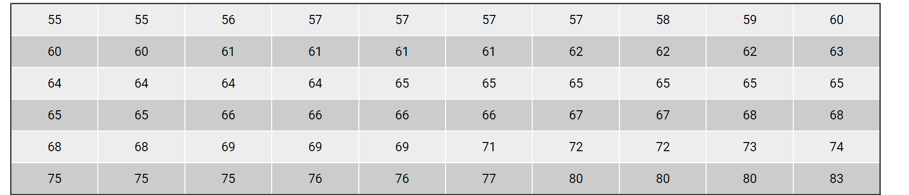

* Calculamos a amplitude dos dados: R = xmáx – xmin = 83 – 55 = 28;

* Vamos escolher um número de classes maior que 5 e menor que 20. Escolheremos 14 classes porque é um número divisível pela amplitude que é igual a 28;

* A largura de cada classe será igual à amplitude total dos dados divididos pelo número de classes, o que nos dá 28 dividido por 14 que é igual a 2. A largura de cada classe será igual a 2;

* Depois, determinaremos os limites inferior e superior para cada classe;

* Finalmente, contaremos quantas ocorrências temos em cada classe com base nos dados ordenados apresentados na Tabela

* 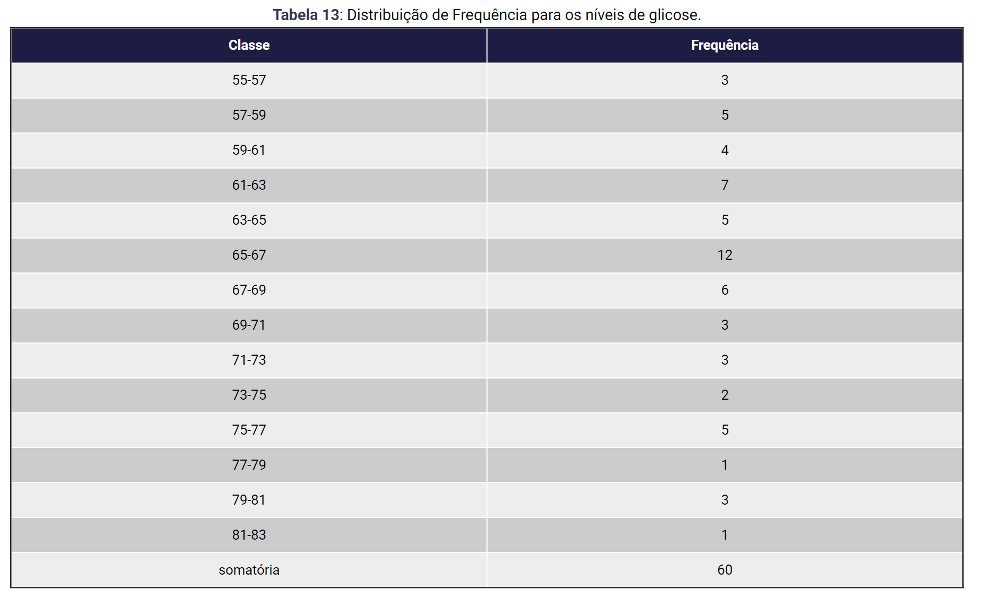
  * É importante explicar que, na primeira classe, pusemos a contagem dos valores maiores ou iguais a 55 e menores que 57. Na segunda classe, pusemos a contagem dos valores maiores ou iguais a 57 e menores que 59. E assim por diante. Somente na última classe colocamos os valores a contagem dos valores maiores ou iguais a 81 e menores ou iguais a 83 para ficarmos com um total de 14 classes.

* A somatória das frequências tem que ser igual ao número total de dados dos quais dispomos. Costumamos expressar a frequência em termos de porcentagem, mas também expressamos em forma de frequência acumulada. Ao fazê-lo com os dados da Tabela 14, obteremos os seguintes resultados:
  * 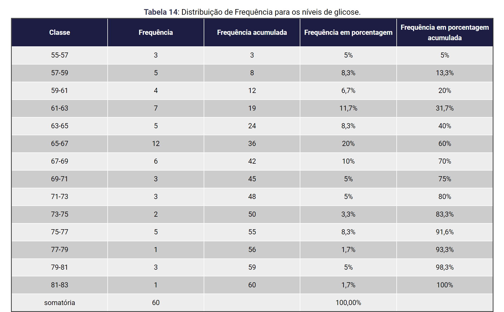 
  * As frequências acumuladas são calculadas ao se somar a frequência da classe atual com a frequência da classe posterior. O mesmo raciocínio se aplica à frequência acumulada em forma de porcentagem.
  * Observando a tabela, pode-se concluir que a taxa de glicose mais frequente essta na classe 65-67.
  
### Calculo quantas classes:
Se nao for definido o numero de classes escolher um numero maior que 5 e menor que 20 ou realizar o calculo abaixo:
  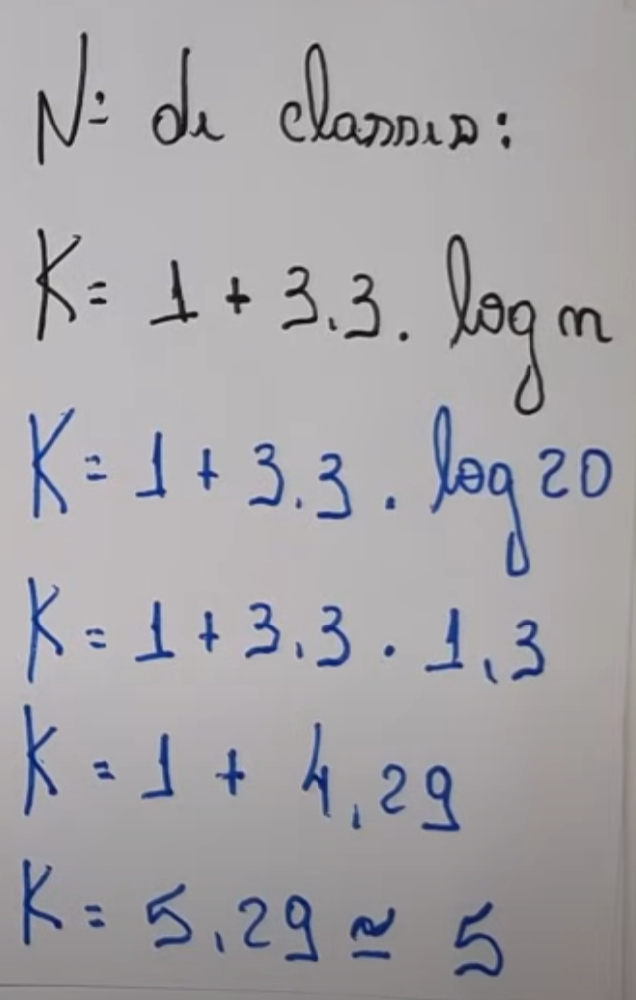

## Medidas de Associaçao
* As medidas de associaçao mais importantes sao a covariancia e a correlaçao entre duas variaveis x e y.

### Correlaçao
* A correlaçao é definida como uma relaçao entre duas variaveis.
* Sua base de referencia é o par ordenado: uma ocorrencia na qual se calculam dois valores

#### Coeficiente de Pearson:

O coeficiente de Pearson, também conhecido como coeficiente de correlação de Pearson ou simplesmente correlação de Pearson, é uma medida estatística que quantifica a relação linear entre duas variáveis aleatórias. É representado por "r" e varia de -1 a 1. Uma correlação de 1 indica uma correlação positiva perfeita, -1 indica uma correlação negativa perfeita, e 0 indica ausência de correlação linear.

A fórmula do coeficiente de Pearson é dada por:

r = Σ[(Xi - X̄) (Yi - Ȳ)] / [√(Σ(Xi - X̄)²) * √(Σ(Yi - Ȳ)²)]

Onde:

"n" é o número de observações
"Xi" é o valor da i-ésima observação da variável X
"Yi" é o valor da i-ésima observação da variável Y
"X̄" é a média dos valores de X
"Ȳ" é a média dos valores de Y
Essa fórmula calcula a covariância entre as duas variáveis e normaliza-a pela multiplicação dos desvios padrão das duas variáveis. O resultado é um número entre -1 e 1, que indica a força e a direção da relação linear entre as duas variáveis.

* Formula Geral:
* coeficiente 

* Onde o termo x_ é a media aritmetica da primeira variavel x.
* 

* Onde o termo y_ é a media aritmetica da primeira variavel y.
* 

* Se r for positiva, quando x se eleva, y tambem se eleva
* se r for negativa, quando x se eleva, y diminui e vice-versa.
* Se r for zero, nao há correlaçao linear entre as variaveis, pois r é um coeficiente de corrrelaçao linear.

### Covariancia
* Covariancia amostral entre duas variaiveis, de tipo quantitativo, descreve a direçao e o grau com que as variaveis se associam linearmente
* A covariância amostral é uma medida estatística que quantifica o grau de interdependência entre duas variáveis aleatórias em um conjunto de dados. Ela indica se as duas variáveis tendem a aumentar ou diminuir juntas. A fórmula da covariância amostral é dada por:

* Formula
* cov(X, Y) = Σ[(Xi - X_barra) * (Yi - Y_barra)] / (n - 1)
  * n é o número de observações
  * Xi é o valor da i-ésima observação da variável X
  * Yi é o valor da i-ésima observação da variável Y
  * X_barra é a média dos valores de X
  * Y_barra é a média dos valores de Y
  * Essa fórmula calcula o produto dos desvios dos valores observados das variáveis X e Y em relação às suas médias respectivas, e depois divide pela quantidade de observações menos um (n - 1). Isso é feito para fornecer uma estimativa não tendenciosa da covariância populacional.

#### Exemplos Covariancia e Correlaçao
* Na tabela são dadas as notas de cálculo e física de oito alunos de Engenharia.
* 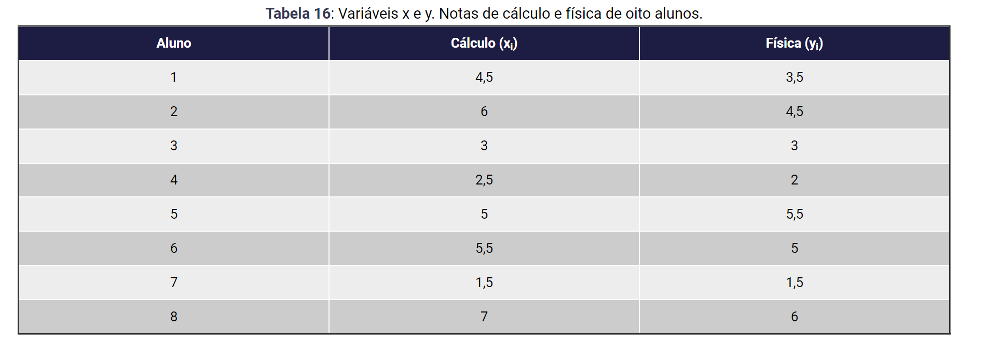
* Os resultados do cálculo do coeficiente de correlação estão na Tabela:
  * 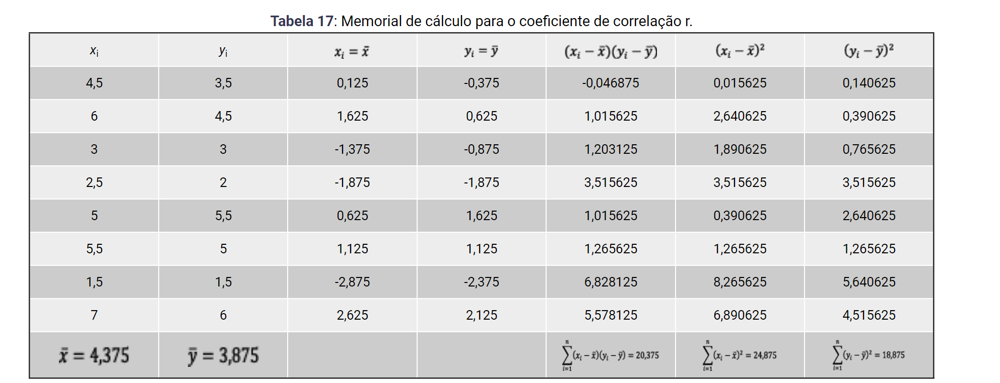
  * Com base nessa tabela, o cálculo do coeficiente de correlação r fica:
    * 
* Agora, vamos colocar o memorial de cálculo para a covariância (Tabela 18):
  * 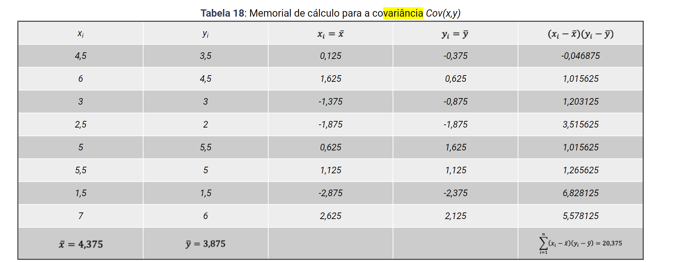
  * 
* O coeficiente de correlação r = 0,94 significa que, quando as notas de cálculo dos alunos aumentam, as notas de física também aumentam. Quando as notas de cálculo diminuem, as notas de física também diminuem.
* Quanto ao valor da covariância Cov(x,y) = 2,910, este significa que as notas de cálculo e física apresentam uma dispersão entre si igual a 2,910.